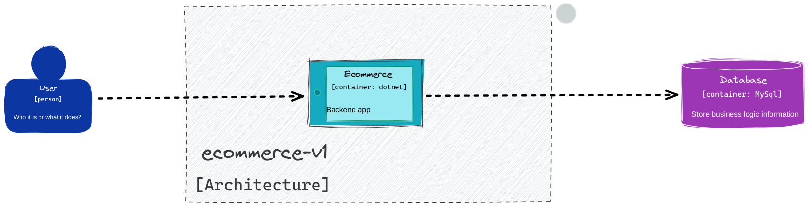
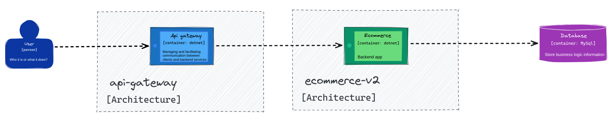
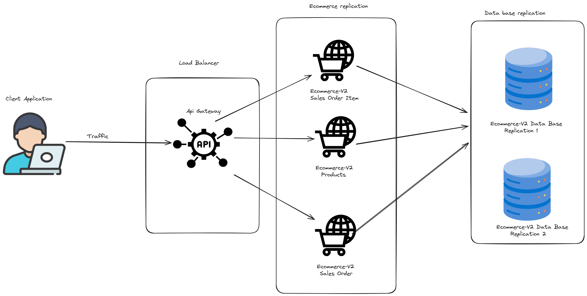
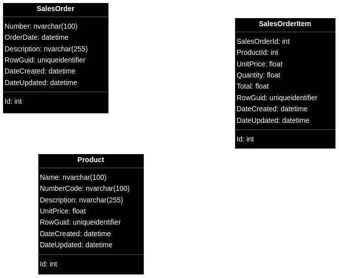
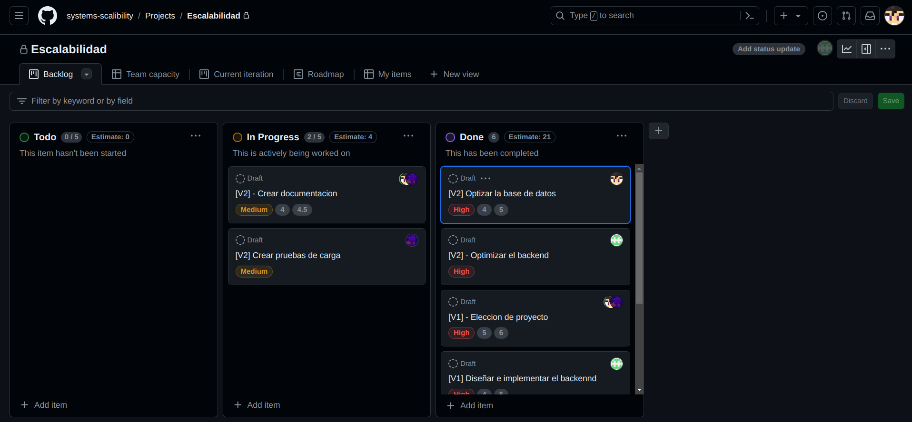
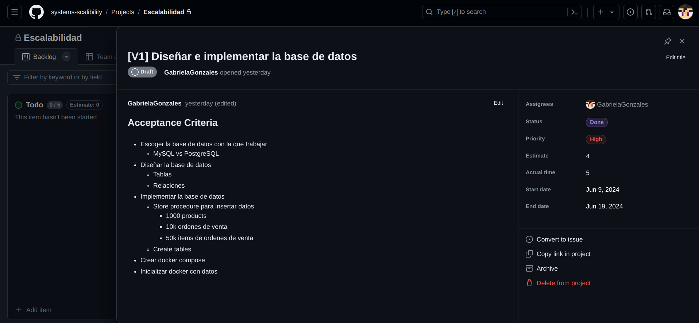

# Proyecto final - Escalabilidad de sistemas

## Features

- Aplicación de E-commerce
- Aplicación hecha desde cero que solo cuenta con backend
- Se tiene dos repositorios:
    - **v1**: Simboliza la primera version de la aplicación la cual no esta optimizada
    - **v2**: Simboliza la version mejorada de la aplicación usando escalabilidad
- La aplicación cuenta con la habilidad de auto escalado
- Carga

## Casos de uso

1. Historial de todos los items de ordenes de venta por código del producto siguiendo las 3 primeras letras como input
2. Todos los item de ordenes de venta en un rango de fechas
3. Todos los items de ordenes de venta filtrados por cantidad

## Diagrama de Arquitectura

### Arquitectura Version 1

La primera arquitectura va enfocada a una aplicacion monolito que usa la arquitectura Onion. Este enfoque de capas busca
la separacion de responsabilidades y facilita el mantenimiento y evolucion de la aplicacion a largo plazo.

### Arquitectura version 2

La arquitectura actual va enfocada a microservicios con un api gateway, el ecommerce-v2 donde

- Api gateway: es el punto de acceso para las solicitudes de los clietnes
- Ecommerce-v2: es el sistema que ejecuta la logica de negocio este accede a la base de datos y continua usanado la arquitectura Onion

La ventaja de una arquitectura de microservicios es que permite una escalabilidad horizontal permitiendo la creacion de
mas instancias de la aplicacion ecommerce-v2

## Tablas comparativas
Tabla de comparacion de tiempo de ejecuciones, las implementaciones compardas son la implementacion inicial en monolito y la nueva implementacion en microservicios

| Query Type             |  Implementacion Actual Monolito (ms) | Nueva Implementacion Micro Servicios (ms) |
|------------------------|-----------------------------|-------------------------|
| MySQL by CodeNumber    | 44.165                       | 22.110                  |
| MySQL by Date Range    | 105.583                       | 61.234                  |
| API by CodeNumber      | 95.123                  | 76.891                  |
| API by Date Range      | 88.546                   | 68.938                  |
| API by Quantity        | 72.457                   | 45.166                  |
             |

### Observaciones:

- **Consultas MySQL**: La nueva implementación muestra tiempos de respuesta mejorados.

La nueva implementación parece mejorar significativamente los tiempos de consulta de MySQL, y proporciona tiempos de respuesta para las solicitudes API mejoradas 
### Lenguaje de programación

**C# vs Python**

| Aspecto                | C#                                                                                           | Python                                                                                        |
|------------------------|----------------------------------------------------------------------------------------------|-----------------------------------------------------------------------------------------------|
| **Rendimiento**        | C# es un lenguaje compilado, lo que generalmente resulta en un mejor rendimiento en tiempo de ejecución. | Python es un lenguaje interpretado, lo que puede resultar en un rendimiento más lento.        |
| **Mantenimiento**      | C# tiene una sintaxis estricta y un tipado estático que ayuda a prevenir errores en tiempo de compilación y facilita el mantenimiento de grandes bases de código. | Python es dinámicamente tipado, lo que puede conducir a errores que solo se detectan en tiempo de ejecución. |
| **Soporte Corporativo**| C# es respaldado por Microsoft, ofreciendo un soporte extenso y herramientas empresariales avanzadas. | Python tiene un soporte comunitario fuerte, pero menos respaldo corporativo directo comparado con C#. |
| **Seguridad**          | C# incluye características de seguridad avanzadas en su plataforma .NET y herramientas de análisis estático de código. | Python también tiene buenas prácticas de seguridad, pero depende más de librerías externas. |
| **Facilidad de Escalado** | C# es ideal para aplicaciones empresariales grandes, con herramientas como ASP.NET para el desarrollo web escalable. | Python es excelente para prototipos y desarrollos rápidos, pero puede enfrentar desafíos en escalabilidad a gran escala. |

**Conclusion**

Aunque Python es un lenguaje poderoso y versátil, especialmente adecuado para el desarrollo rápido y la experimentación, C# ofrece ventajas significativas en términos de rendimiento, herramientas de desarrollo y mantenimiento, y soporte corporativo, lo que lo convierte en la opción elegida para el e-commerce.

### Base de datos

**Relacional vs No Relacional**

| Aspecto                  | Base de Datos Relacional (SQL)                                         | Base de Datos No Relacional (NoSQL)                                           |
|--------------------------|------------------------------------------------------------------------|------------------------------------------------------------------------------|
| **Estructura de Datos**  | Esquema fijo y tablas con relaciones definidas. Ideal para datos estructurados y transaccionales. | Esquema flexible y documentos, gráficos, clave-valor, o columnas. Ideal para datos semiestructurados o no estructurados. |
| **Escalabilidad**        | Escalado vertical (mejorar el hardware del servidor). Escalado horizontal es más complejo. | Escalado horizontal (agregar más servidores) es más sencillo y común.        |
| **Rendimiento**          | Excelente para consultas complejas y transacciones.                   | Alto rendimiento para grandes volúmenes de datos y acceso rápido.             |
| **Modelo de Datos**      | Ideal para relaciones complejas y datos estructurados.                | Ideal para datos flexibles y cambios frecuentes en el esquema.               |
| **Integridad Referencial**| Soporte completo para claves foráneas y reglas de integridad.         | Generalmente no soporta integridad referencial nativa.                       |
| **Desempeño en Lectura** | Rendimiento eficiente en lectura para datos relacionados y consultas complejas. | Alto rendimiento en lectura para grandes volúmenes de datos y datos distribuidos. |
| **Desempeño en Escritura**| Rendimiento eficiente en escrituras, pero puede degradarse con alta concurrencia. | Optimizado para escrituras rápidas y alta concurrencia.                      |
| **Manejo de Datos**      | Mejor para transacciones críticas y análisis complejos.               | Mejor para grandes volúmenes de datos y accesos rápidos.                     |
| **Flexibilidad del Esquema**| Menos flexible; los cambios en el esquema pueden ser costosos.      | Muy flexible; permite cambios frecuentes en el esquema sin mucho esfuerzo.   |
| **Ejemplos Populares**   | MySQL, PostgreSQL, Oracle, SQL Server.                                 | MongoDB, Cassandra, DynamoDB, Redis.                                         |

**Conclusion**

Aunque las bases de datos no relacionales tienen sus propias ventajas, especialmente en términos de flexibilidad y escalabilidad horizontal, una base de datos relacional es frecuentemente la mejor opción para el e-commerce debido a su capacidad para manejar transacciones complejas y datos estructurados con alta consistencia y fiabilidad.

**MySQL vs PostgreSQL**

| Aspecto                 | MySQL                                                                                   | PostgreSQL                                                                        |
|-------------------------|-----------------------------------------------------------------------------------------|-----------------------------------------------------------------------------------|
| **Rendimiento**         | Generalmente más rápido en operaciones de lectura intensiva.                             | Más lento en comparación con MySQL en operaciones de lectura intensiva.            |
| **Replicación**         | Soporte robusto para replicación master-slave y master-master, fácil de configurar.      | Soporte para replicación, pero históricamente más complejo de configurar.          |
| **Popularidad**         | Muy popular y ampliamente utilizado en aplicaciones web, respaldado por una gran comunidad. | Popular pero menos utilizado en comparación con MySQL, aunque tiene una comunidad activa. |
| **Facilidad de Uso**    | Más fácil de instalar y configurar para principiantes.                                    | Más complejo de configurar, con una curva de aprendizaje más pronunciada.          |
| **Soporte de Sharding** | MySQL soporta sharding nativamente a través de soluciones como MySQL Fabric.             | PostgreSQL soporta sharding, pero generalmente requiere soluciones externas.       |
| **Documentación y Soporte**| Documentación extensa y muchos recursos disponibles debido a su gran popularidad.    | Documentación completa pero menos recursos en comparación con MySQL.               |
| **Escalabilidad**       | Mejor escalabilidad vertical y buenas opciones de escalabilidad horizontal con replicación. | Alta escalabilidad, pero la replicación y el sharding pueden ser más complejos de implementar. |
| **Uso en la Industria** | Usado por muchas grandes empresas y plataformas web, incluyendo Facebook, Twitter y YouTube. | También usado por grandes empresas, pero con menos adopción en startups y pequeñas empresas. |
| **Desempeño en Consultas Simples** | Excelente desempeño en consultas simples y de lectura intensiva.                  | Buen desempeño, pero puede ser más lento en comparación con MySQL en algunas consultas simples. |

**Conclusion**

La replicación en MySQL es robusta y fácil de configurar, lo que es crucial para aplicaciones que requieren alta disponibilidad y distribución de datos. Además, su popularidad y amplio uso en la industria garantizan una gran cantidad de recursos y soporte, haciendo de MySQL una excelente elección para muchas aplicaciones web y empresariales.

### Servicios

API Gateway vs Load Balancer

| Característica                      | API Gateway                                              | Load Balancer                                      |
|-------------------------------------|----------------------------------------------------------|----------------------------------------------------|
| **Función Principal**               | Gestiona y enruta las solicitudes a microservicios.      | Distribuye el tráfico entre múltiples servidores.  |
| **Capas de la Aplicación**          | Opera en la capa de aplicación (OSI - capa 7).           | Opera principalmente en la capa de transporte (OSI - capa 4) o la capa de aplicación (OSI - capa 7). |
| **Gestión de Solicitudes**          | Maneja solicitudes HTTP/HTTPS, autenticación, autorización, transformaciones y agregación de respuestas. | Distribuye solicitudes de red (HTTP/HTTPS, TCP/UDP) entre varios servidores para balancear la carga. |
| **Seguridad**                       | Proporciona autenticación, autorización, filtrado y protección contra ataques. | Puede proporcionar características básicas de seguridad como SSL/TLS, pero no autenticación y autorización avanzada. |
| **Transformación de Datos**         | Puede transformar las solicitudes y respuestas (por ejemplo, convertir formatos de datos). | No transforma datos; simplemente enruta solicitudes. |
| **Manejo de API**                   | Ofrece funcionalidades específicas para la gestión de APIs, como versionado y limitación de tasa. | No tiene funcionalidades específicas para APIs. |
| **Enrutamiento Avanzado**           | Soporta enrutamiento avanzado basado en contenido, reglas y condiciones específicas de negocio. | Principalmente enruta basándose en el estado del servidor y la disponibilidad. |
| **Monitorización y Análisis**       | Proporciona métricas detalladas y análisis sobre el uso de APIs y rendimiento. | Ofrece métricas básicas sobre la distribución de carga y el rendimiento del servidor. |
| **Microservicios**                  | Optimizado para arquitecturas de microservicios, facilitando la comunicación y gestión entre ellos. | Útil para cualquier tipo de arquitectura, no específicamente optimizado para microservicios. |
| **Integración con Servicios**       | Facilita la integración con servicios externos, autenticación de terceros y agregación de servicios. | No tiene características específicas para la integración de servicios externos. |

### Ejemplo de Uso
- **API Gateway**: Ideal para arquitecturas de microservicios donde se necesita una gestión centralizada de solicitudes, autenticación, y enrutamiento avanzado.
- **Load Balancer**: Ideal para distribuir la carga entre múltiples servidores para mejorar la disponibilidad y escalabilidad de la aplicación.

En resumen, los Load Balancers son una herramienta esencial para garantizar que su aplicación pueda manejar cargas de trabajo variables y mantener un alto nivel de rendimiento y disponibilidad por lo que la hace la opcion ideal para el proyecto.

## Diagrama topológico de los servidores

1.  **Aplicación Cliente**: El usuario interactúa con la aplicación cliente, que podría ser un navegador web, una aplicación móvil u otro tipo de interfaz de usuario.
    
2.  **Tráfico**: La solicitud del usuario es enviada desde la aplicación cliente al API Gateway a través de la red.
    
3.  **API Gateway**: Este componente actúa como el punto de entrada central para todas las solicitudes de los clientes. El API Gateway maneja las solicitudes, las autentica, y las enruta a los servicios apropiados en la capa de replicación del e-commerce.
    
4.  **Balanceador de Carga**: Distribuye las solicitudes entrantes de manera equitativa entre los diferentes servicios del e-commerce para asegurar que ninguno de ellos se sobrecargue y para mejorar la disponibilidad y la escalabilidad del sistema.
    
5.  **E-commerce**:
    
    -   **Ecommerce-V2 Sales Order Item**: Servicio responsable de manejar los ítems de las órdenes de venta.
    -   **Ecommerce-V2 Products**: Servicio responsable de manejar la información de los productos.
    -   **Ecommerce-V2 Sales Order**: Servicio responsable de manejar las órdenes de venta.
    
6.  **Replicación de Base de Datos**:
    
    -   **Ecommerce-V2 Data Base Replication 1**: Primera réplica de la base de datos del sistema de e-commerce.
    -   **Ecommerce-V2 Data Base Replication 2**: Segunda réplica de la base de datos del sistema de e-commerce.
    
    Estas réplicas aseguran la alta disponibilidad y la redundancia de los datos, permitiendo que las operaciones de lectura y escritura sean distribuidas para mejorar el rendimiento y la resiliencia del sistema.

## Diagrama de la base de datos

### Tablas

- **Product:** Guarda información básica de un producto
- **SalesOrderItem:** Guarda información de un producto con la diferencia de que se especifica la cantidad de producto
  que se quiere
- **SalesOrder:** Guarda `SalesOrderItems`, puede tener varios `SalesOrderItems` y el conjunto de estos harían una
  orden.

## Tiempos - Mediciones

-

## Optimizaciones

### Base de datos

**Primera version**

Base de datos la cual cargaba los siguientes datos:

- 1000 productos
- 50000 items de ordenes
- 10000 ordenes

**Segunda version**

Para la segunda version se aplico *Replication* con el tipo de *Master-Slave* la cual nos indica que hay un servidor que
es el master y otras que son los slave (replicas).

Las razones por las que aplicamos replicación son:

- Scaling out: Cuando la mayoría de las operaciones en la base de datos son de lectura, se puede distribuir las lecturas
  entre las bases de datos (slave) mientras la principal (master) se mantiene disponible para manejar las escrituras.
- Analíticas: Se tiene una replica de la base de datos que se encarga de queries lentos lo que permite que no se
  interrumpa la disponibilidad de la base de datos principal para escribir.
- Seguridad: Se puede pausar una replica y realizar una copia de seguridad sin temor a que se dañen los datos en la base
  de datos principal.

### Código
**Primera version**

Para el acceso a queries el ecommerce permite realizar petition http, esta api tiene logica definida para cada peticion requerida. Los action son creados para los use cases con logica especifica. Como la arquitectura esta enfocada a Onion cada servicio accede a la base de datos con su propia logica lo conlleva duplicacion de codigo

**Segunda version**

A nivel de codigo en el ecommerce se optimizo la logica para acceder a la base de datos, dado que las llamadas CRUD se repiten. La logica de los action ahora van enfocado a API Rest, con el uso de OData por lo cual no es necesario crear logica especifica para cada use case. Por el api gateway al ser usado como una aplicacion en si permite poder configurar llamados a una o varias instancias del ecommerce

## Asignación de tareas

Se utilizo GitHub Projects para asignar las tareas

Cada task tiene:

- Acceptance Criteria
- A quien se asigno la tarea
- Estado de la tarea
- Prioridad
- Tiempo estimado en terminar la tarea
- Tiempo actual que le tomo en completar la tarea
- Fecha de inicio de la tarea
- Fecha de finalización de la tarea

